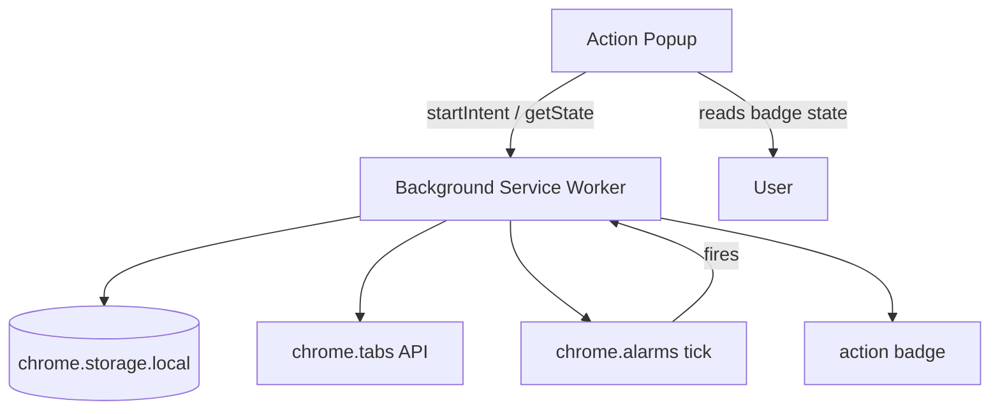

# Architecture

This document explains how **Why Am I Here?** works internally.

## Design goals

1. **Least privilege** — only `tabs` and `storage` permissions.
2. **Privacy** — all data stays in `chrome.storage.local` on the user's device.
3. **Non-intrusive** — optional intent entry, badge + popup check-ins (no system notifications).
4. **Useful nudges** — check-ins appear only when browsing patterns suggest a rabbit hole.

## Product improvements over the original idea

| Original idea | Implementation choice |
|---------------|----------------------|
| Fixed 30-minute timer | Configurable interval (default 30 min) with snooze |
| Show when 40 tabs open | Configurable total tab threshold (default 40) |
| Count related tabs | Keyword matching on tab title + URL |
| Binary prompt | Three actions: completed, keep going, dismiss |
| Forced new-tab flow | Popup-only goal entry; Chrome new tab stays default |

## Components

### Popup entrypoint (`entrypoints/popup/`)

- Set or replace a goal (Enter or button).
- Shows current goal, active minutes, and related tab count.
- Settings hidden behind the gear icon.
- Primary UI for check-ins.

### Background service worker (`entrypoints/background.ts`)

Manifest V3 uses an event-driven service worker instead of a persistent background page.

Responsibilities:

1. **Session lifecycle** — create, update, complete, dismiss, snooze.
2. **Tab tracking** — listen to tab/window events, refresh matches.
3. **Active focus time** — count minutes only while a related tab is focused in an active window.
4. **Alarms** — periodic tick via `chrome.alarms` (no permission required).

## Data model

### `IntentSession`

| Field | Purpose |
|-------|---------|
| `id` | UUID |
| `intent` | Raw user text |
| `keywords` | Normalized tokens for matching |
| `startedAt` | Session start timestamp |
| `activeFocusMs` | Ms spent on related tabs in a focused window |
| `focusStartedAt` | Current focused stretch start, or null |
| `checkInAfterActiveMs` | Active ms required before check-in |
| `status` | `active` \| `completed` \| `dismissed` |
| `trackedTabIds` | Non-internal tabs currently open |
| `relatedTabIds` | Open tabs matching intent keywords |
| `seenRelatedTabIds` | Unique related tabs seen this session |

### `PendingCheckIn`

Snapshot shown in the popup when check-in conditions are met.

### `ExtensionSettings`

| Setting | Default | Meaning |
|---------|---------|---------|
| `checkInIntervalMinutes` | 30 | Active minutes on related tabs before check-in |
| `tabCountThreshold` | 40 | Minimum open tabs to trigger |
| `minRelatedTabs` | 3 | Minimum intent-related tabs |

## Intent matching (`utils/intent-matcher.ts`)

1. **Keyword extraction** — lowercase, strip punctuation, remove stop words (`looking`, `for`, `the`, etc.).
2. **Tab matching** — concatenate tab title + URL; require enough keyword hits:
   - For multi-keyword intents: at least 2 keyword matches (or all keywords if fewer than 2).
   - For single-keyword intents: 1 match.

Internal browser URLs (`chrome://`, `chrome-extension://`, etc.) are excluded from counts.

## Check-in logic (`utils/session-manager.ts`)

A check-in is surfaced when **all** are true:

1. Session is `active`.
2. `activeFocusMs` ≥ `checkInAfterActiveMs`.
3. `totalTabCount` ≥ `tabCountThreshold`.
4. `seenRelatedTabIds.length` ≥ `minRelatedTabs`.

This avoids nagging during small research sessions or unrelated heavy tab usage.

## Messaging protocol

UI entrypoints use `browser.runtime.sendMessage` with typed payloads:

| Message | Direction | Purpose |
|---------|-----------|---------|
| `startIntent` | UI → BG | Begin tracking |
| `getState` | UI → BG | Read session, pending check-in, settings |
| `respondToCheckIn` | UI → BG | `completed` / `continue` / `dismissed` |
| `clearSession` | UI → BG | End active session |
| `updateSettings` | UI → BG | Persist user settings |

## Security considerations

- **No `host_permissions`** — the extension never injects scripts into web pages.
- **No external network** — nothing is exfiltrated; no remote config.
- **No `notifications` permission** — reduces attack surface and store review friction.
- **Input validation** — empty/vague intents are rejected before creating sessions.
- **Local storage only** — `chrome.storage.local` keeps data on-device.

## Build system

[WXT](https://wxt.dev/) generates `manifest.json` from `wxt.config.ts` and file-based entrypoints. Builds output to `.output/chrome-mv3/` and release zips via `pnpm zip`.

## Tests

Pure logic is covered by Vitest in `tests/`:

- keyword extraction and tab matching
- session creation, check-in eligibility, snooze/history helpers

Background messaging and Chrome APIs are thin wrappers around tested utilities.
