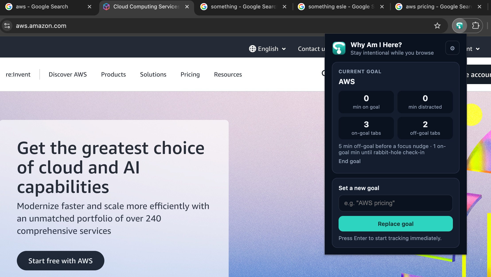
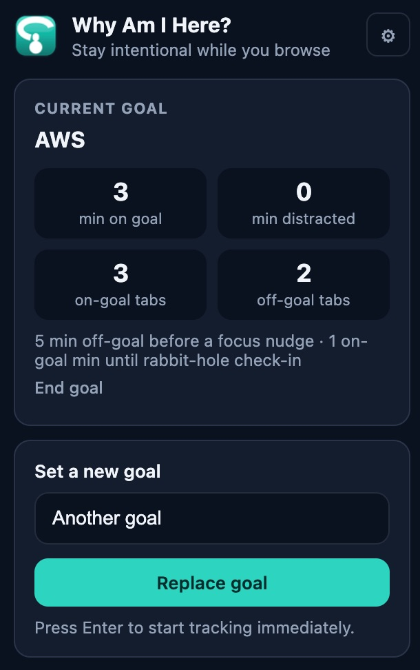
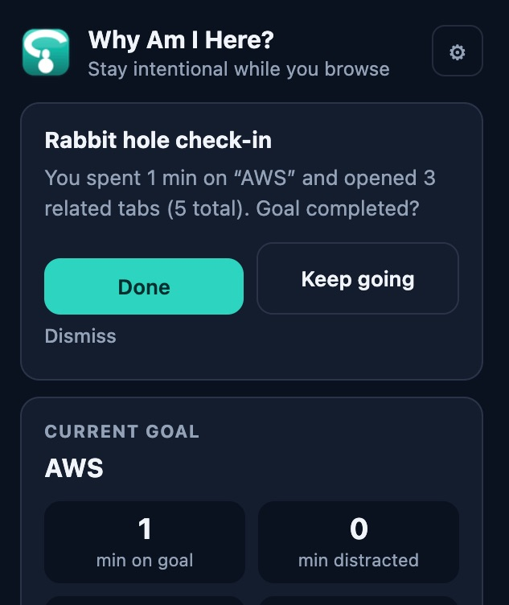
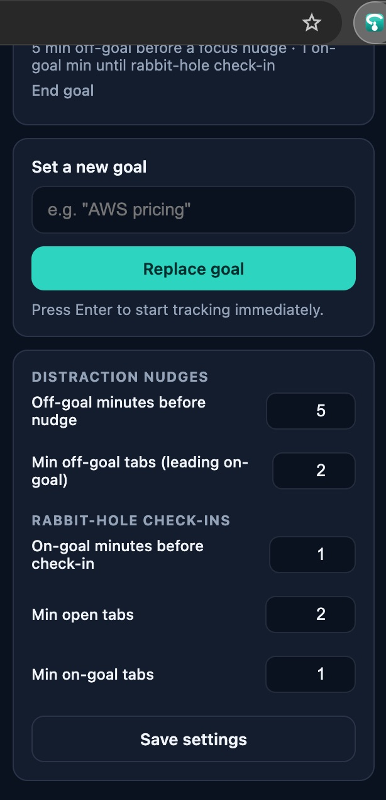

# How to use Why Am I Here?

This helps you work on **one thing at a time** — stay focused on it, and notice when you’ve spent too long on it (distraction or rabbit hole).

If your goal changes, just type a new one and press **Set goal** (or **Replace goal**). No need to end the old one first.

To stop tracking without setting a new goal, tap **Stop goal** in the popup — you don't have to wait for a nudge or timer.

Short guide. Three steps.

## 1. Set a goal

Click the **?** icon in your toolbar. Type what you came to do — for example `AWS pricing` — and press **Set goal** (or Enter).

The extension starts counting which tabs match your goal and how long you spend on them.

## 2. Browse like normal

Keep working. Open the popup anytime to see:

- minutes on goal vs distracted
- how many tabs are on-goal vs off-goal

No need to do anything else — tracking runs in the background while Chrome is focused. Switching tasks? Set a new goal anytime.

## 3. Answer when it nudges you

When the icon shows **!**, open the popup.

- **Focus nudge** — you drifted to off-goal tabs. Get back on task or tap **Back on track** to snooze.
- **Rabbit-hole check-in** — you stayed on topic a long time with many tabs. Tap **Done**, **Keep going**, or **Dismiss**.

### Optional: change when nudges fire

Click the **⚙** gear in the popup. Adjust distraction and rabbit-hole thresholds, then **Save settings**.

---

**Install:** [Chrome Web Store](https://chromewebstore.google.com/detail/why-am-i-here/oljicgnpidagkgpnpcdihcbdkimibefl)
